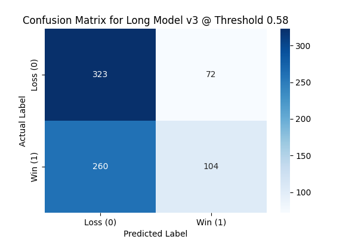
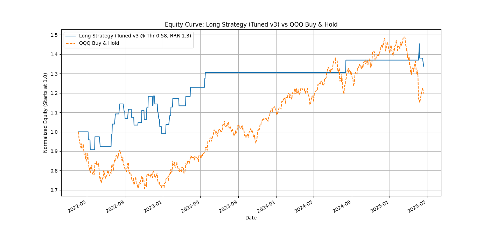
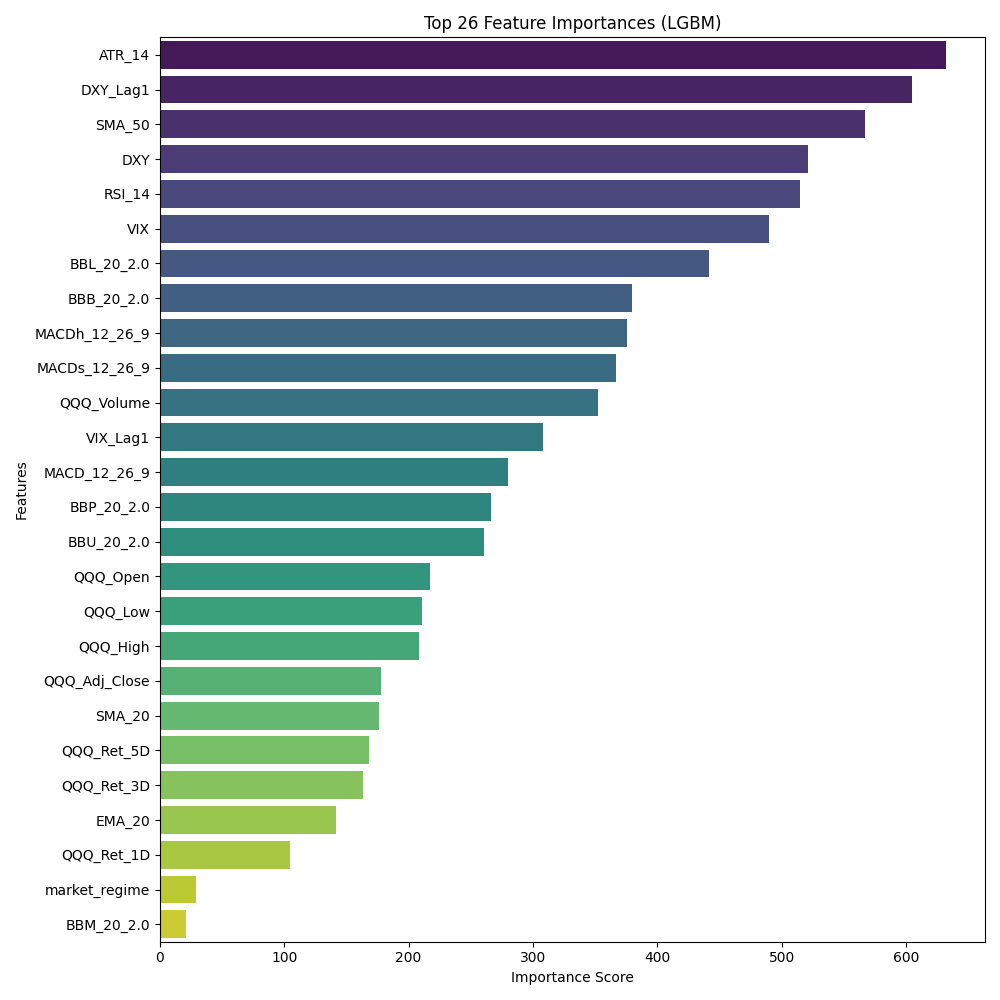

# QQQ AI Trading Signal Bot (Small-Scale Test Project) feat. Gemini

本專案為「優式AI量化新星計畫」而開發，旨在探索、建立並評估一個基於AI模型的QQQ指數ETF做多交易策略。專案實現了從數據獲取、特徵工程、模型訓練、訊號產生到Telegram Bot互動查詢的完整流程。

## Project Aim / 專案目標
* 運用機器學習方法（LightGBM）預測QQQ的做多交易機會。
* 建立一套包含進場、止損、止盈規則的交易策略。
* 透過歷史數據回測評估策略的有效性，追求正期望值和合理的勝率。
* 實現一個Telegram Bot，能按需提供最新的交易訊號評估。

## Key Features / 主要功能
* 可按需（透過Bot指令 `/getsignal`）獲取最新的QQQ、VIX、DXY市場數據，並產生下一交易日的做多訊號評估。
* 基於獲取的數據計算28項特徵，包括技術指標（SMA, EMA, RSI, MACD, BBands, ATR）、市場情緒指標（VIX, DXY的滯後值）以及市場狀態（基於QQQ與SMA200的關係判斷牛熊）。
* 使用預先訓練好的LightGBM模型 (`tuned_lgbm_long_model_v3.joblib`) 預測下一交易日做多盈利的機率。
* 交易結構：當預測機率超過最佳閾值 (0.58) 時產生做多訊號，止損設置為進場價 - 1.5 x ATR；止盈設置為進場價 + 1.3 x (1.5 x ATR)。
* 實現Telegram Bot互動式查詢。

## Methodology & Workflow / 方法論與工作流程
1.  **Data Acquisition / 數據獲取：** 使用 `yfinance` 函式庫下載QQQ、VIX、DXY的每日歷史數據 (2010年至今)。
2.  **Feature Engineering / 特徵工程：** 計算了包括移動平均線、RSI、MACD、布林通道、ATR、短期報酬率、VIX/DXY滯後值以及基於SMA200的`market_regime`等28個特徵。
3.  **Target Variable Definition / 目標變數定義：**
    * 做多 (`y_long_outcome`)：基於 `N=1.5` (ATR乘數) 設定止損，`target_rrr_long=1.3` 設定止盈。若先觸及止盈則標記為1（盈利），先觸及止損則標記為0（虧損）。此設定旨在獲取更高的單筆盈利潛力。
    * 做空 (`y_short_outcome`)：初步探索顯示使用固定止盈止損結構效果不佳，故專案主要聚焦於做多策略。
4.  **Model Training & Selection / 模型訓練與選擇：**
    * 選用 `LightGBMClassifier`。
    * 對做多模型（基於 `target_rrr_long=1.3` 標籤）進行了超參數調優 (`RandomizedSearchCV` 配合 `TimeSeriesSplit`)。
    * 通過預測機率閾值分析，為調優後的模型選定最佳操作點 (閾值0.58)。
5.  **Backtesting & Evaluation / 回測與評估：**
    * 在測試集 (2022-04-04 到 2025-04-21) 上對選定的做多策略（調優模型v3 @ 閾值0.58, RRR=1.3）進行了事件驅動的回測。
    * 評估指標包括勝率、期望值、總回報率、最大回撤、夏普比率，並與同期QQQ買入並持有策略進行比較。
6.  **Telegram Bot / Telegram Bot：**
    * 使用 `python-telegram-bot` 函式庫實現互動式查詢。

## Key Visualizations / 主要視覺化成果

### Confusion Matrix
*(做多模型的混淆矩陣圖)*



*圖註：此處顯示了最終選用的做多模型（模型v3，閾值0.58）在測試集上的混淆矩陣，展示了其對盈利（Win）和虧損（Loss）的預測分類情況。*

### Equity Curve Comparison
*(策略權益曲線 vs QQQ買入並持有)*

 

*圖註：此處顯示了做多策略（模型v3，閾值0.58，RRR=1.3）在測試期間與QQQ買入並持有策略的權益曲線對比。*

### Feature Importance
*(做多模型的特徵重要性圖)*



*圖註：此處展示了最終選用的做多模型認為最重要的特徵。*

## Main Backtest Results / 主要回測成果 
**(做多策略: 調優模型v3 @ 閾值0.58, N=1.5, RRR=1.3)**
* **回測期間 (Test Period)：** 2022-04-04 到 2025-04-21 (約3年)
* **總交易次數 (Total Trades)：** 38 次
* **勝率 (Win Rate)：** 55.26%
* **平均每次盈利 (Average Win %):** +4.92%
* **平均每次虧損 (Average Loss %):** -3.93%
* **已實現風險報酬比 (Achieved RRR)：** 1.25
* **策略期望值 (Expectancy: WR\*RRR - LR)：** 0.2450
* **策略總回報率 (Total Return, Compounded)：** +38.58%
* **同期 QQQ 買入並持有回報率 (QQQ Buy & Hold)：** +19.70%
* **策略最大回撤 (Max Drawdown)：** -13.45%
* **策略年化夏普比率 (Annualized Sharpe Ratio, est.)：** 0.76
* **QQQ同期年化夏普比率 (QQQ Sharpe Ratio, est.)：** 0.37

## Setup and Installation / 安裝與設定
1.  **Environment / 環境要求：** Python 3.11+ (建議與 `requirements.txt` 中的版本一致)。
2.  **Clone Repository / 複製檔案：**
    ```bash
    git clone https://github.com/YuTsyh/QQQ-AI-Trading-Signal-Bot
    cd QQQ-AI-Trading-Signal-Bot
    ```
3.  **Create and Activate Virtual Environment (Recommended) / 建立並啟用虛擬環境 (推薦)：**
    ```bash
    python -m venv venv
    # Windows
    venv\Scripts\activate
    # macOS/Linux
    # source venv/bin/activate
    ```
4.  **Install Dependencies / 安裝依賴：**
    ```bash
    pip install -r requirements.txt
    ```
5.  **Configure Bot / 設定組態檔：**
    * 複製 `config.example.py` 檔案，並將其重命名為 `config.py`。
    * 用你自己的 Telegram Bot Token 編輯 `config.py`：
        ```python
        # config.py
        BOT_TOKEN = "YOUR_ACTUAL_TELEGRAM_BOT_TOKEN_HERE"
        ```
    * **重要：`config.py` 已被添加到 `.gitignore` 中，請勿將包含真實Token的 `config.py` 上傳到公開的GitHub倉庫！**

6.  **Model File / 模型檔案：**
    * 本檔案已包含預訓練的模型檔案 `tuned_lgbm_long_model_v3.joblib`，它是用與 `requirements.txt`兼容的環境訓練和保存的。

## Usage / 使用說明
1.  **Start Telegram Bot (Interactive Mode) / 啟動 Telegram Bot (互動模式)：**
    在已啟用虛擬環境並完成設定後，從專案根目錄運行：
    ```bash
    python qqq_telegram_bot.py
    ```
    Bot啟動後，你可以在Telegram中與其對話：
    * `/start`：查看歡迎訊息。
    * `/getsignal`：獲取對下一交易日的QQQ做多訊號評估。
